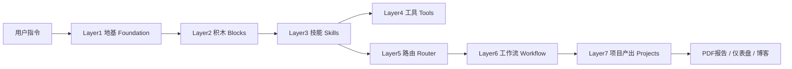

# AI-SEO-GEO-
这个项目是一个基于 Claude Code 打造的自动化 AI SEO 与 GEO（生成式引擎优化）流量引擎。它通过集成多种 AI 技能和外部工具，旨在帮助用户在 AI 搜索时代（如 ChatGPT、Perplexity、Claude）快速获取流量，其核心价值在于将复杂的 SEO 审计、策略制定、内容生产和质量检测全流程自动化

---

```markdown
# 🚀 SEO/GEO 自动化增长工厂 (Agency-in-a-Box)

> **基于 Claude Code 的全域 AI 自动化生产线 | 七层工程架构 V4.1**

[](./)
[](./)
[](./)
[](./)

** 本系统是一个专为 Claude Code 设计的全自动 SEO/GEO 智能代理（Agent），深度融合了生成式引擎优化（GEO）与传统的技术性 SEO，让 AI 流量留存率提升至传统搜索的 3 倍。

---

## 📖 目录

- [核心亮点](#-核心亮点)
- [系统架构](#-系统架构)
- [功能矩阵（12 大核心技能）](#-功能矩阵12-大核心技能)
- [快速开始](#-快速开始)
- [使用指南（Commands）](#-使用指南commands)
- [环境变量与配置](#-环境变量与配置)
- [项目目录结构](#-项目目录结构)
- [技术栈](#-技术栈)
- [如何扩展](#-如何扩展)
- [常见问题](#-常见问题)

---

## ✨ 核心亮点

- **🎯 目标驱动**：精准提升 ChatGPT、Perplexity 等 AI 搜索引擎的引用流量，访客平均停留时长 ≥ 7 分钟。
- **🏗️ 七层解耦架构**：严格遵循 Foundation → Blocks → Skills → Tools → Router → Workflow → Projects，逻辑清晰，易于维护。
- **🤖 智能模型路由（Router）**：内置额度监控与熔断机制。Claude 额度耗尽时自动降级切换至 Grok / GPT-4o，杜绝超额扣费。
- **💰 Token 极致节约（V4.1）**：全局缓存复用（`_cache`）+ 成本权重分流，相比传统方案降低 40%~70% Token 消耗。
- **🔧 统一工具网关**：Firecrawl、Serper、PageSpeed、Perplexity、Gemini 等外部 API 统一封装，禁止硬编码。

---

## 🏛️ 系统架构

系统基于 **MAP 心法**（Menu + Automation + Productize）与 **CRAFT 框架** 设计，采用七层强制顺序：



| 层级 | 功能描述 |
| :--- | :--- |
| **Layer 1 地基** | 全局配置（.env）、品牌资产（_context）、JSON 注册表 |
| **Layer 2 积木** | 视觉风格指南（STYLE-GUIDE）、竞品素材库、标准模板 |
| **Layer 3 技能** | 12 个标准化内容生产单元（见下文功能矩阵） |
| **Layer 4 工具** | 第三方 API 网关（飞书/Notion/爬虫/性能检测） |
| **Layer 5 路由** | 多模型额度监控、故障转移、Token 成本权重分配 |
| **Layer 6 工作流** | 串行/并行流程编排，支持条件分支与工具节点插入 |
| **Layer 7 项目** | 临时产出归档、交付物打包、看板渲染 |

---

## 🛠️ 功能矩阵（12 大核心技能）

系统内置 12 个标准化技能（Skills），通过精准关键词触发：

| 技能 ID | 名称 | 触发关键词 | 核心产出 |
| :--- | :--- | :--- | :--- |
| `site_strategy` | 网站策略 | `strategy` | 12 周技术修复与内容路线图 |
| `seo_research` | SEO 研究 | `keyword_research` | 关键词 CSV 与竞品分析 |
| `geo_analysis` | AI 搜索分析 | `geo_intent` | AI 引擎引用来源深度报告 |
| `blog_writer` | 博客撰写 | `write_blog` | 1500+ 字 SEO 结构化长文 |
| `geo_optimizer` | GEO 内容优化 | `geo_optimize` | 增加 FAQ/摘要框，提升 AI 引用率 |
| `schema_generator` | Schema 标记 | `generate_schema` | JSON-LD 结构化数据代码 |
| `mockup_gen` | 原型截图 | `screenshot` | 全屏网页截图 PNG |
| `qa_validator` | 质量检测 | `qa_check` | 四层质检（去AI化/合规/事实/GEO） |
| `self_optimize` | 自优化 | `auto_optimize` | 基于 QA 反馈自动重写 |
| `pdf_reporter` | PDF 报告 | `export_pdf` | 专业 A4 审计/策略交付件 |
| `mark_slides` | 幻灯片 | `to_slides` | Marp 格式演示文稿 |
| `dashboard_builder` | 仪表盘 | `build_dashboard` | 本地交互式修复进度看板 |

---

## 🚀 快速开始

### 1. 环境准备
- 安装 [Claude Code](https://docs.anthropic.com/claude-code) 并完成登录。
- 确保本地环境有 Python 3.10+ 和 Node.js（Playwright 依赖）。

### 2. 克隆与初始化
```bash
git clone https://github.com/your-username/seo-geo-automation-factory.git
cd seo-geo-automation-factory
```

### 3. 配置密钥
复制环境变量示例文件并填入你的 API 密钥：
```bash
cp _config/.env.example _config/.env
```
**必须配置的密钥**（在 `.env` 中填写）：
- `CLAUDE_API_KEY`, `GROK_API_KEY`（或其他备用模型）
- `FIRECRAWL_API_KEY`, `SERPER_API_KEY`
- `PERPLEXITY_API_KEY`, `GEMINI_API_KEY`（用于事实核查）
- `PSI_API_KEY`（PageSpeed Insights）

### 4. 在 Claude Code 中启动
在 Claude Code 终端中，粘贴项目根目录下的 `SEO_AGENT.md` 系统提示词（或直接引用该文件）：
```text
请阅读 SEO_AGENT.md 并初始化环境。
```
或直接输入内置命令：
```text
init
```
系统将自动创建完整的七层目录结构、Python 网关脚本及 JSON 注册表。

---

## 📋 使用指南（Commands）

在 Claude Code 对话中，直接输入以下指令驱动工作流：

| 指令 | 说明 |
| :--- | :--- |
| `init` | **首次运行**：自动搭建完整七层目录及配置文件 |
| `audit https://example.com` | **阶段一**：全站技术爬取、性能检测，输出 SEO 评分与错误清单 |
| `generate https://example.com` | **阶段二**：生成 12 周增长策略并自动撰写 GEO 优化后的博客 |
| `qa` | **阶段三**：执行四层质量检测，自动优化并生成 PDF 报告与幻灯片 |
| `start-dashboard` | 启动本地仪表盘（localhost:3000），监控修复进度 |
| `write_blog "你的主题"` | 单技能调用：快速生成一篇符合标准的博文 |
| `status` | 查看当前各模型 Token 消耗与缓存命中率 |

---

## 🔐 环境变量与配置

| 变量名 | 说明 | 是否必填 |
| :--- | :--- | :--- |
| `CLAUDE_API_KEY` | Anthropic Claude API 密钥 | 是 |
| `GROK_API_KEY` | X.AI Grok API 密钥（备用降级） | 否 |
| `FIRECRAWL_API_KEY` | Firecrawl 网页爬取服务密钥 | 是 |
| `SERPER_API_KEY` | Serper.dev 谷歌搜索 API 密钥 | 是 |
| `PERPLEXITY_API_KEY` | Perplexity AI 事实核查密钥 | 是 |
| `GEMINI_API_KEY` | Google Gemini 质量评分密钥 | 是 |
| `QUOTA_TRIGGER_RATIO` | 额度切换阈值（默认 0.9） | 否 |
| `TOKEN_SAVE_MODE` | 是否开启极简输出模式（true/false） | 否 |

---

## 📂 项目目录结构

```text
/
├── _config/                # 核心配置（.env, JSON注册表）
├── _context/               # 品牌/受众/平台持久资产
├── _blocks/                # 风格指南与标准模板
├── _skills/                # 12 个技能 Markdown 定义
├── _tools/                 # 工具网关（md/json/py）
├── _router/                # 模型路由与额度监控
├── _workflow/              # 三大标准工作流 JSON
├── _scripts/               # Python 调度与校验脚本
├── _cache/                 # [V4.1] 复用片段与 Token 统计
└── output/                 # 所有产出（审计/策略/报告/看板）
```

---

## 🧰 技术栈

- **AI 模型**：Claude Opus 4.8（主）、Grok 2（备）、GPT-4o（备）
- **编程语言**：Python 3.10+（网关与调度）、JavaScript（仪表盘）
- **外部服务**：Firecrawl、Serper API、PageSpeed Insights、Perplexity、Gemini
- **渲染与截图**：Playwright、Puppeteer
- **报告生成**：Markdown + Puppeteer PDF
- **数据可视化**：Chart.js（仪表盘）

---

## 🧩 如何扩展

### 新增第三方工具
1. 在 `_tools/tool_json/` 下新建 `xxx.tool.json`（定义接口地址与字段映射）。
2. 在 `_tools/tool_md/` 下新建 `xxx.tool.md`（人工说明）。
3. 在 `_config/tools_registry.json` 注册该工具 ID。
4. 在 `.env` 添加对应 `XXX_API_KEY`。
5. 在目标 Workflow 的 `tools_nodes` 中引用即可。

### 新增大模型
1. 在 `.env` 添加新模型的密钥与额度变量。
2. 修改 `_config/router_registry.json` 的 `model_list`，配置权重与备用队列。
3. 无需改动 Skills/Workflow，路由层自动生效。

---

## ❓ 常见问题 (FAQ)

**Q：为什么不直接使用 Claude 原生的 Project 功能，而要搭建这套目录？**  
A：这套系统提供了**持久化的资产沉淀**（品牌库、缓存片段）、**严格的成本控制**（额度熔断与权重分流）以及**标准化的工具网关**，确保业务不依赖单次会话上下文，真正做到“工厂化”生产。

**Q：如果没有配置备用模型（如 Grok），会怎样？**  
A：Router 层会检测到备用列表为空。若 Claude 额度耗尽，系统会停止调用并触发飞书告警，同时在终端提示“额度不足，请充值或配置备用模型”。

**Q：如何查看 Token 节省的效果？**  
A：运行 `status` 命令，或查看 `_cache/token_stat/` 目录下的日志，对比开启缓存前后的消耗差异。

---

## 📄 许可证

本项目采用 MIT 许可证。详情请参阅 [LICENSE](./LICENSE) 文件。

---

## 🤝 贡献与反馈

欢迎提交 Issue 和 Pull Request。如果你有更好的 GEO 优化策略或新的工具集成建议，请通过 GitHub 与我们联系。

**Star 这个仓库，让 AI 帮你把 SEO 业务放大 10 倍！** ⭐
```

---

### 💡 使用建议

1. **替换链接**：将 `https://github.com/your-username/seo-geo-automation-factory.git` 替换为你的实际仓库地址。
2. **添加徽章**：如果你有 CI/CD 或代码覆盖率，可以替换 `shields.io` 的占位链接。
3. **截图与演示**：建议在 README 中插入一张 **仪表盘（Dashboard）** 的截图或 **系统架构图**，能让仓库在第一眼就吸引访客。
4. **强调商业价值**：将“83 万曝光”和“3 倍留存”放在最显眼的位置，这是技术人员和业务负责人都会感兴趣的关键指标。
